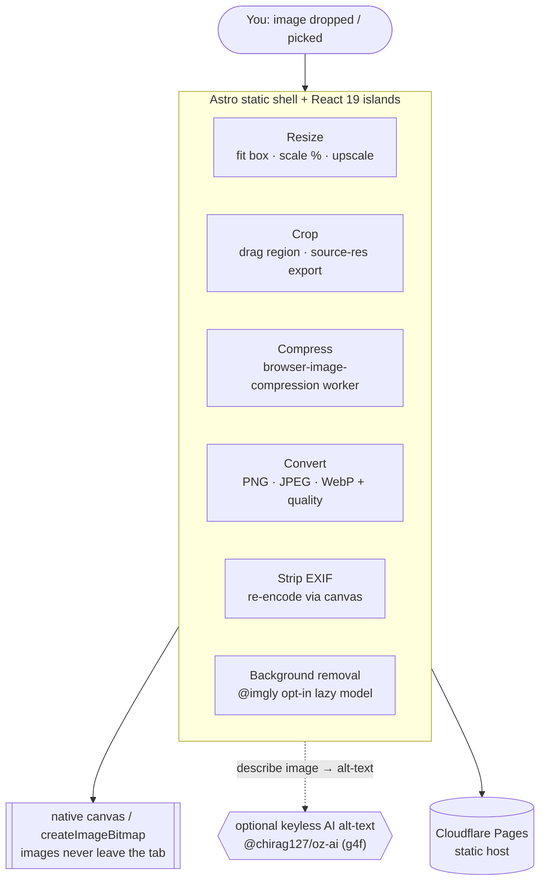

# oriz-img

> Client-side image toolkit — resize, crop, compress, convert (PNG/JPEG/WebP) & strip EXIF. 100% in-browser, no upload.

[](LICENSE)
[](https://github.com/chirag127/oriz-img/stargazers)
[](https://github.com/chirag127/oriz-img/commits)
[](https://astro.build)

**Live app:** https://img.oriz.in · **About:** https://chirag127.github.io/oriz-img/ · **Repo:** https://github.com/chirag127/oriz-img

A darkroom for your images that runs entirely in the browser: resize, crop, compress, convert between PNG / JPEG / WebP, and strip EXIF metadata — with optional AI background removal. Every pixel is processed in this tab via native `<canvas>` + `createImageBitmap`; nothing is ever uploaded, and heavy libraries load only when you use them so first paint stays instant.

⭐ If this is useful, please [star the repo](https://github.com/chirag127/oriz-img/stargazers) — it helps others find it.

## How it works



## Features

- **Resize** — fit inside a max box (aspect-preserving) or scale by percent; optional upscaling.
- **Crop** — drag a region on a live preview; exports source-resolution pixels.
- **Compress** — target a file size (web-worker `browser-image-compression`, lazy-loaded on use).
- **Convert** — PNG · JPEG · WebP with a quality slider (JPEG/WebP).
- **Strip EXIF** — re-encodes through canvas, dropping all EXIF/GPS/camera metadata.
- **Background removal** — opt-in, lazy `@imgly/background-removal` (~40 MB model, warned before load).
- **AI alt-text** — optional caption via `@chirag127/oz-ai` (keyless g4f multi-provider failover; degrades gracefully offline).
- **Before/after slider** — signature wipe comparison of original vs. result.
- **PWA-installable** — works offline after first load. No backend, no telemetry.

## Tech stack

- **Astro 6** static output.
- **React 19** islands.
- **Tailwind CSS v4** with a bespoke per-site theme.
- **[browser-image-compression](https://github.com/Donaldcwl/browser-image-compression)** — worker-based compression (dynamically imported).
- **[@imgly/background-removal](https://github.com/imgly/background-removal-js)** — opt-in in-browser background removal.
- **Shared `@chirag127/oz-*` packages** — `oz-ai` (keyless g4f AI), `oz-file`, `oz-chrome`, `oz-tokens-base`.
- **Vitest** — unit tests over the pure image math.
- **Cloudflare Pages** — static hosting.

## Repo structure

```
oriz-img/
├── src/
│   ├── pages/          # Astro routes (image toolkit)
│   ├── components/      # React islands (resize, crop, compress, convert, bg-remove)
│   ├── lib/            # canvas ops, image math, lazy loaders
│   ├── layouts/        # base HTML layout / meta
│   └── styles/         # Tailwind v4 entry + theme tokens
├── tests/             # Vitest specs (pure image math)
├── public/            # static assets, icons, manifest
└── astro.config.mjs   # Astro config
```

## Screenshots

See the live app in action at **https://img.oriz.in**.

## Quick start

```bash
npm install --legacy-peer-deps
npm run dev       # local dev server
npm run test      # vitest — pure image math
npm run build     # static build → dist/
npm run deploy    # build + wrangler pages deploy (Cloudflare Pages)
```

> Windows: use **npm** (pnpm skips `@esbuild/win32-x64` and the Astro build crashes).

## Configuration

Fully client-side — **no environment variables required**. Images never leave your browser. The optional AI alt-text uses `@chirag127/oz-ai` (keyless g4f/gpt4free), so there is no API key to configure.

## Part of the oriz family

One of ~80 sites in the [oriz](https://blog.oriz.in) family — a fleet of small, fast, client-side tools that run **$0 on the Cloudflare free tier**.

> **Hosting:** the canonical live app is served from **Cloudflare Pages** at [img.oriz.in](https://img.oriz.in). GitHub Pages serves a separate info/landing page at [chirag127.github.io/oriz-img](https://chirag127.github.io/oriz-img/).

## Related projects

- [oriz-color](https://github.com/chirag127/oriz-color) — color studio (also does local image palette extraction).
- [oriz-text](https://github.com/chirag127/oriz-text) — writing-desk text toolkit.
- [oriz-invoice](https://github.com/chirag127/oriz-invoice) — GST-aware invoice generator.
- [oriz-chat](https://github.com/chirag127/oriz-chat) — free client-side AI chat.

## Contributing

Issues and PRs welcome. Conventional commits are the changelog.

## Status

Stable.

## License

MIT © 2026 Chirag Singhal · chirag@oriz.in
